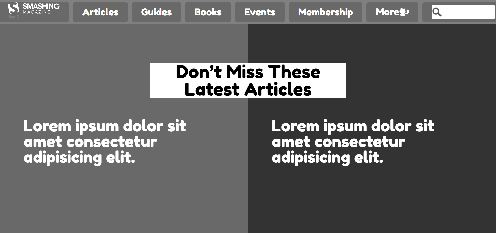

# Smashing-Magazine-Clone

> This is our fifth project in microverse the smashing magazine clone

## Built With

- HTML
- CSS ( grid and flex )

## Live Demo

[Live Demo Link](https://alexisbec.github.io/Smashing-Magazine-Clone/)

## Getting Started

1. Clone the project 
  https://github.com/alexisbec/Smashing-Magazine-Clone.git

2. Then open index.html in your browser

To get a local copy up and running follow these simple example steps.

### Prerequisites

Just ensure you have one or more web browsers

## Authors

👤 **Author1**

- GitHub: [@alexisbec](https://github.com/alexisbec)
- Twitter: [@AlexisV31667779](https://twitter.com/AlexisV31667779i)
- LinkedIn: [LinkedIn](https://www.linkedin.com/in/alexis-varela-2584111b7/)

👤 **Author2**

- GitHub: [@pacyL2K19](https://github.com/pacyL2K19)
- Twitter: [@PacifiqueLinja1](https://twitter.com/PacifiqueLinja1)
- LinkedIn: [LinkedIn](https://www.linkedin.com/in/pacifique-linjanja-2a565517b/)

## 🤝 Contributing

Contributions, issues, and feature requests are welcome!
Feel free to contribute 
Feel free to check the [issues page](https://github.com/ahzia/HTML-Signup-Form/issues/3).

## Show your support

Give a ⭐️ if you like this project!

## 📝 License

This project is [MIT]() licensed.